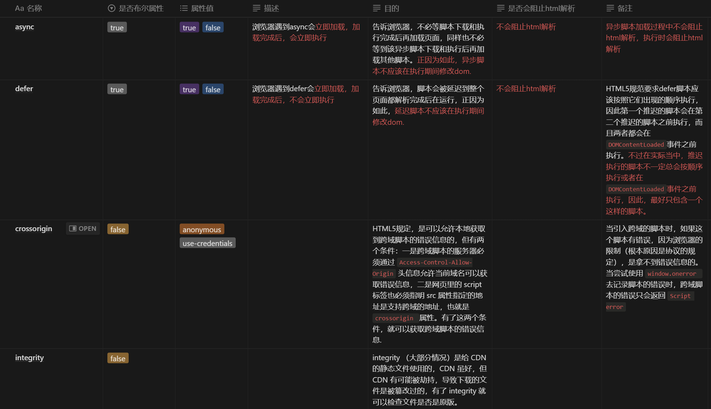

# script

## 概述

## script标签属性对比



## 相关事件

- load

    事件在整个页面及所有依赖资源如样式表和图片都已完成加载时触发（也需要等待子框架完成加载后，即子框架的`load`事件之后）

- DOMContentLoaded

    当初始的`HTML`文档被完全加载和解析完成之后，`DOMContentLoaded`事件被触发，而无需等待样式表、图像和子框架（比如`iframe`）的完全加载。

## async与defer的区别

- 相同点

    - `defer`与`async`的加载都不会阻塞`html`解析

- 不同点

    - 执行时机：

        - 浏览器遇到`async`会立即加载，加载完成后，会立即执行，如果此时`html`未解析完，会阻塞`html`解析，所以多个`async`的执行顺序不一定会按照它们在文档中出现的顺序执行，异步脚本会保证在`load`事件前执行。

        - 浏览器遇到`defer`会立即加载，加载完成后，不会立即执行，直到`html`解析完成后`DOMContentLoaded`之前才会执行，即会保证等文档完成解析完成后会按照他们在文档出现顺序再去执行。

    - DOMContentLoaded事件：

        - DOMContentLoaded事件不会等待`async`脚本运行完成，只要`html`解析完成就会触发

        - DOMContentLoaded会等待`defer`脚本运行后才会触发

- 图解说明

    - script

        ```mermaid
        gantt
            dateFormat X
            axisFormat %s         
            section HTML解析         
            HTML                :done, 0, 10
            HTML                :done, 20, 30
            section js资源下载
            Script Download     :active, 10, 15
            section js脚本执行 
            Script Execution    :crit, 15, 20
        ```

    - script async

        ```mermaid
        gantt
            dateFormat X
            axisFormat %s 
            section HTML解析
            HTML                :done, 0, 10
            HTML                :done, 15, 25
            section js资源下载
            Script Download     :active, 5, 10
            section js脚本执行 
            Script Execution    :crit, 10, 15
        ```

    - script defer

        ```mermaid
        gantt
            dateFormat X
            axisFormat %s 
            section HTML解析
            HTML                :done, 0, 20
            section js资源下载
            Script Download     :active, 5, 10
            section js脚本执行 
            Script Execution    :crit, 20, 25
        ```

