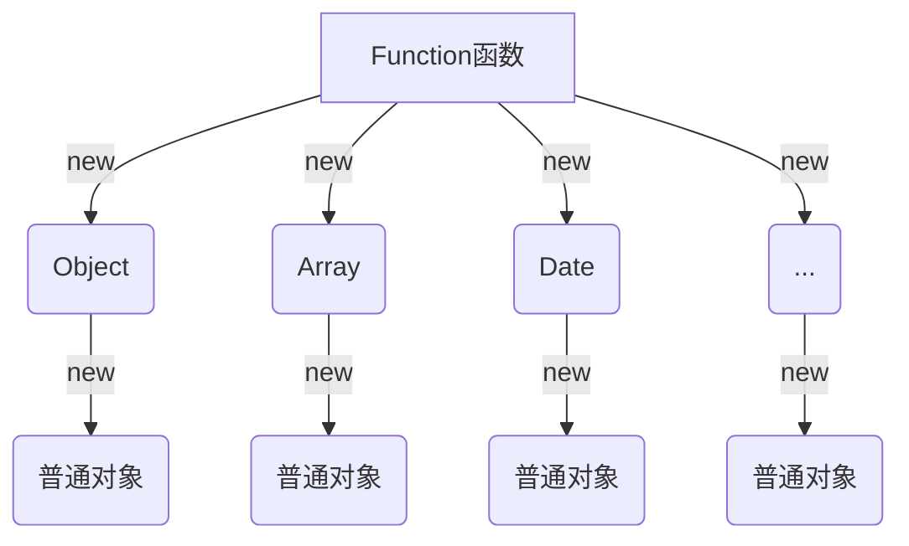
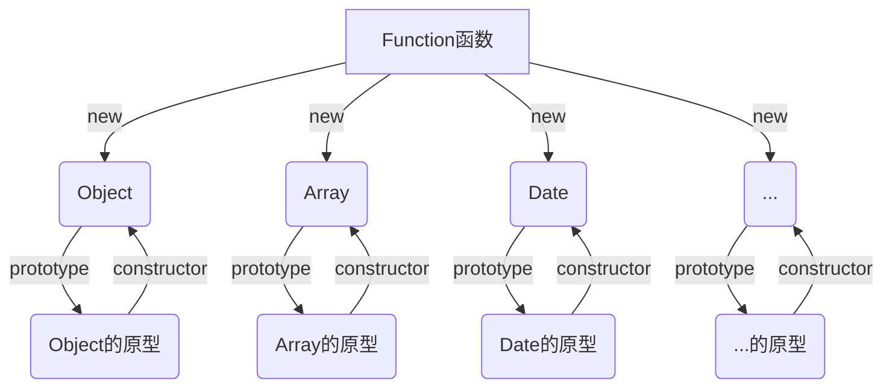
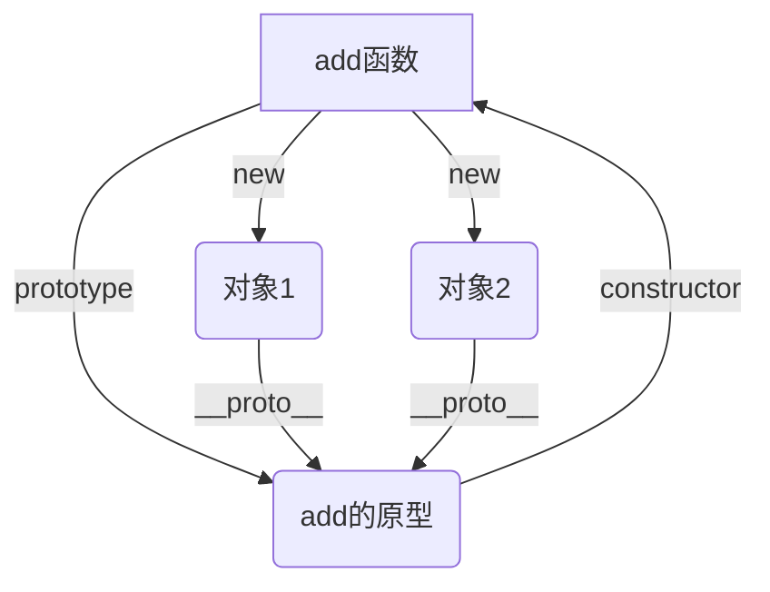

# 原型

## 函数对象与普通对象

- 所有的函数也是对象

- 所有对象都是通过```new 函数```创建

:::tip

`Function` 这个函数(也是对象),是浏览器引擎注入的

:::



## 函数原型

- 所有函数都有一个属性：prototype,称之为函数原型

:::tip

例外:箭头函数没有函数原型

:::

- 默认情况下,prototype是一个普通的Object对象

- 默认情况下,prototype中有一个属性,constructor,它也是一个对象,它指向构造函数本身



## 隐式原型

- 所有的对象都有一个属性：`__proto__`，称之为隐式原型
    
:::tip

`Object.creat(null)`，得到的结果也是对象，但该对象没有隐式原型

代理对象也有没有隐式原型

:::

- 默认情况下，**隐式原型指向创建该对象的函数的原型**

