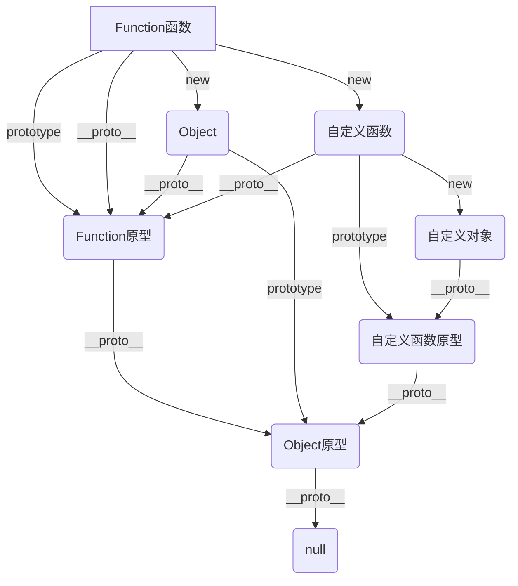

# 原型链

- 特殊情况

    - `Function`的`__proto__`指向自身的`prototype`(因为该`Function`是浏览器引擎直接注入到内存中的)

    - `Object`的`prototype`的`__proto__`指向`null`（`prototype`也是个对象，该对象的`__proto__`指向`null`）

- 当访问一个对象的成员时

    - 看该对象自身是否拥有该成员，如果有直接使用

    - 在原型链中依次查找是否拥有该成员，如果有直接使用

- 猴子补丁：在函数原型中加入成员，以增强起对象的功能，猴子补丁会导致原型污染，使用需谨慎

- 基础方法

    - **获取对象的隐式原型：**`Object.getPrototypeOf`(对象)

    - **判断当前对象(this)是否在指定对象的原型链上：**`Object.prototype.isPrototypeOf`(对象)

    - **判断函数的原型是否在对象的原型链上（尽量不要用，有很多奇怪问题）**：对象 `instanceof` 函数

    - **创建一个新对象，其隐式原型指向指定的对象：**`Object.create`(对象)

    - 判断一个对象**自身**是否拥有某个属性：`prototype.hasOwnProperty`(属性名)

- 应用

    - 类数组转换为真数组：`Array.prototype.slice.call`(类数组)

    - 实现继承