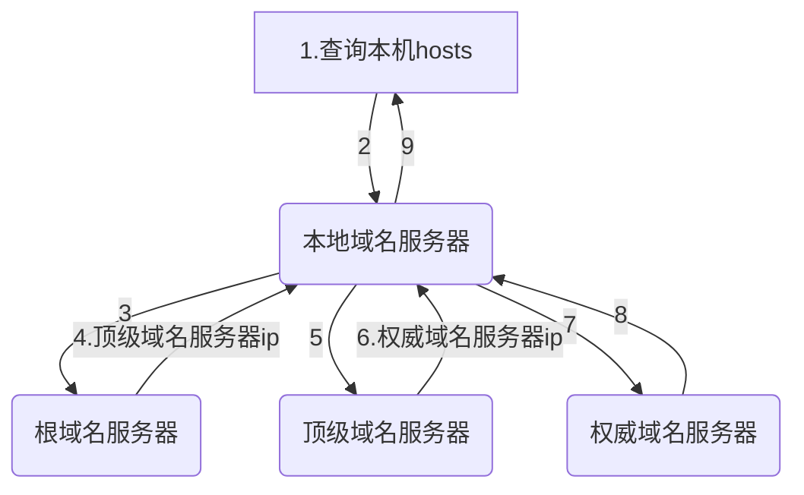

# 域名

## 概述

- 根域名：`.`

- 顶级域名：`.cn .com .net .us .uk .org ... `

- 二级域名：`.com .gov .org .edu 自定义 baidu jd ...`

- 三级域名：`自定义 www.baidu.com www.jd.com`

- 四级域名：`自定义 www.pku.edu.cn  mail.internal.jd.com`

## DNS

域名虽然有助于记忆，但是网络传输和域名没有半毛钱关系

所以，必须有一个东西，能够将域名转换成`IP`地址，这个东西就是DNS服务器，翻译成`IP`地址的过程称之为**域名解析**

## DNS服务器

全世界认可的DNS服务器一共有三种，外加一种局部使用的本地DNS服务器，一共四种

为了使得解析速度更快、查询的节点更少，上述每个节点都可能设置高速缓存来加速解析

## 域名解析过程

- 查找浏览器是否DNS缓存

- 查找操作系统是否有DNS缓存

- 查找本机hosts文件中是否有解析记录，如果有，直接使用

:::tip

权限域名服务器也可称为权威域名服务器

:::

- 查找本地域名服务器中是否有解析记录，如果有，直接使用

- 查询根域名服务器，得到顶级域名服务器ip

- 查询顶级域名服务器中是否有解析记录，如果有，直接使用

- 根据顶级域名服务器反馈的ip，查询权限域名服务器，如果有解析记录，直接使用

- 如果以上都找不到，域名解析失败

:::tip

本机和域名服务器一般都会有高速缓存，它存在的目的是为了减少查询次数和时间

:::