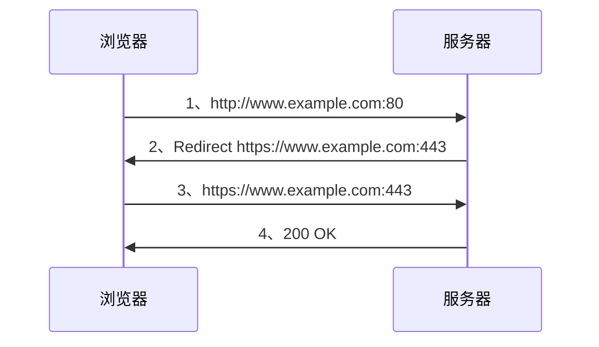
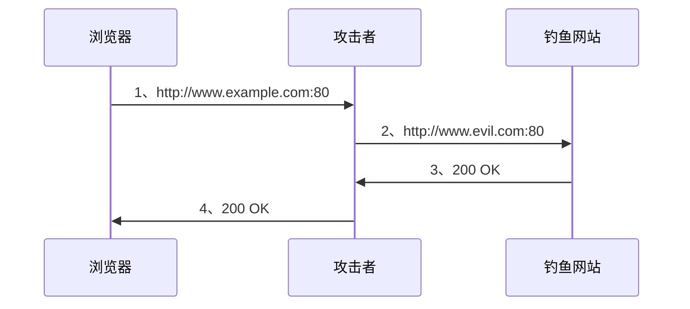
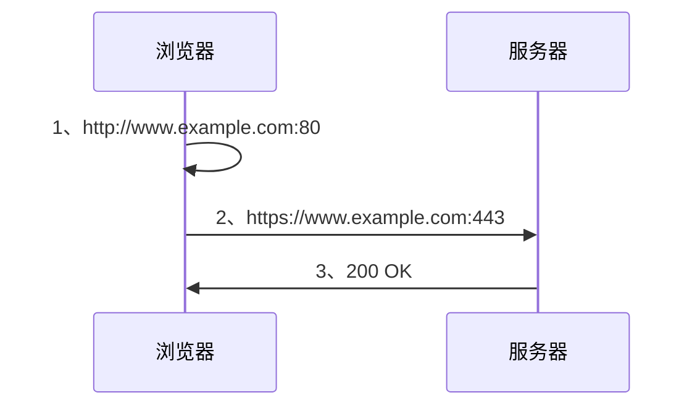
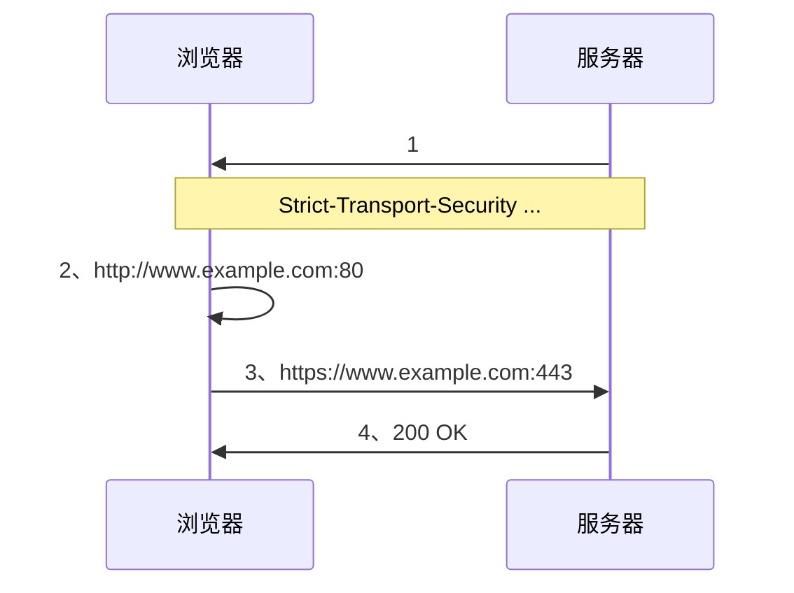

# HSTS

## 概述

HSTS（HTTP Strict Transport Security）国际互联网工程组织IETF正在推行一种新的Web安全协议HSTS，它的作用是强制客户端（如浏览器）使用HTTPS与服务器创建连接;采用HSTS协议的网站将保证浏览器始终连接到该网站的HTTPS版本，不需要用户手动在URL地址栏中输入加密地址;该协议将帮助网站采用全局加密，用户看到的就是该网站的安全版本;HSTS的作用是强制客户端（如浏览器）使用HTTPS与服务器创建连接.

## 服务器开启HSTS的方法

当客户端通过HTTPS发出请求时，在服务器返回的超文本传输协议响应头中包含Strict-Transport-Security字段;非加密传输时设置的HSTS字段无效;比如，`https://xxx` 的响应头含有`Strict-Transport-Security: max-age=31536000; includeSubDomains`;这意味着两点：在接下来的一年（即31536000秒）中，浏览器只要向xxx或其子域名发送HTTP请求时，必须采用HTTPS来发起连接;比如，用户点击超链接或在地址栏输入 `http://xxx/` ，浏览器应当自动将 http 转写成 https，然后直接向 `https://xxx/` 发送请求;在接下来的一年中，如果 xxx 服务器发送的TLS证书无效，用户不能忽略浏览器警告继续访问网站。

## HSTS可以用来抵御SSL剥离攻击

SSL剥离攻击是中间人攻击的一种，由Moxie Marlinespike于2009年发明;他在当年的黑帽大会上发表的题为 New Tricks For Defeating SSL In Practice 的演讲中将这种攻击方式公开;SSL剥离的实施方法是阻止浏览器与服务器创建HTTPS连接;它的前提是用户很少直接在地址栏输入`https://`，用户总是通过点击链接或3xx重定向，从HTTP页面进入HTTPS页面;所以攻击者可以在用户访问HTTP页面时替换所有`https://`开头的链接为`http://`，达到阻止HTTPS的目的;HSTS可以很大程度上解决SSL剥离攻击，因为只要浏览器曾经与服务器创建过一次安全连接，之后浏览器会强制使用HTTPS，即使链接被换成了HTTP;另外，如果中间人使用自己的自签名证书来进行攻击，浏览器会给出警告，但是许多用户会忽略警告;HSTS解决了这一问题，一旦服务器发送了HSTS字段，用户将不再允许忽略警告

## SSL剥离攻击

有不少网站只通过HTTPS对外提供服务，但用户在访问某个网站的时候，在浏览器里却往往直接输入网站域名（例如www.example.com）;而不是输入完整的URL（例如`https://www.example.com`），不过浏览器依然能正确的使用HTTPS发起请求;这背后多亏了服务器和浏览器的协作，如下图所示(服务器和浏览器在背后帮用户做了很多工作)

简单来讲就是，浏览器向网站发起一次HTTP请求，在得到一个重定向响应后，发起一次HTTPS请求并得到最终的响应内容;所有的这一切对用户而言是完全透明的，所以在用户眼里看来，在浏览器里直接输入域名却依然可以用HTTPS协议和网站进行安全的通信，是个不错的用户体验。一切看上去都是那么的完美，但其实不然，**由于在建立起HTTPS连接之前存在一次明文的HTTP请求和重定向（上图中的第1、2步），使得攻击者可以以中间人的方式劫持这次请求，从而进行后续的攻击，例如窃听数据，篡改请求和响应，跳转到钓鱼网站等。**以劫持请求并跳转到钓鱼网站为例，其大致做法如下图所示(劫持HTTP请求，阻止HTTPS连接，并进行钓鱼攻击)：

第1步：浏览器发起一次明文HTTP请求，但实际上会被攻击者拦截下来

第2步：攻击者作为代理，把当前请求转发给钓鱼网站

第3步：钓鱼网站返回假冒的网页内容

第4步：攻击者把假冒的网页内容返回给浏览器

这个攻击的精妙之处在于，攻击者直接劫持了HTTP请求，并返回了内容给浏览器，根本不给浏览器同真实网站建立HTTPS连接的机会;因此浏览器会误以为真实网站通过HTTP对外提供服务，自然也就不会向用户报告当前的连接不安全;于是乎攻击者几乎可以神不知鬼不觉的对请求和响应动手脚。

## 使用HSTS避免SSL剥离攻击

既然建立HTTPS连接之前的这一次HTTP明文请求和重定向有可能被攻击者劫持，那么解决这一问题的思路自然就变成了如何避免出现这样的HTTP请求。我们期望的浏览器行为是，当用户让浏览器发起HTTP请求的时候，浏览器将其转换为HTTPS请求，**直接略过上述的HTTP请求和重定向**，从而使得中间人攻击失效，规避风险。其大致流程如下(略过HTTP请求和重定向，直接发送HTTPS请求)：

第1步：用户在浏览器地址栏里输入网站域名，浏览器得知该域名应该使用HTTPS进行通信

第2步：浏览器直接向网站发起HTTPS请求

第3步：网站返回相应的内容

那么问题来了，浏览器是如何做到这一点的呢？**它怎么知道那个网站应该发HTTPS请求，那个网站应该用HTTP请求呢？**此时就该HSTS粉墨登场了。

## HSTS 语法

HSTS最为核心的是一个HTTP响应头（HTTP Response Header）。正是它可以让浏览器得知，在接下来的一段时间内，当前域名只能通过HTTPS进行访问，并且在浏览器发现当前连接不安全的情况下，强制拒绝用户的后续访问要求。

HSTS Header的语法如下：

- Strict-Transport-Security: <max-age=> [; includeSubDomains ] [; preload ] 其中：

    - max-age是必选参数，是一个以秒为单位的数值，它代表着HSTS Header的过期时间，**通常设置为1年**，即31536000秒。

    - includeSubDomains是可选参数，如果包含它，则意味着当前域名及其子域名均开启HSTS保护。

    - **preload是可选参数，只有当你申请将自己的域名加入到浏览器内置列表的时候才需要使用到它**。关于浏览器内置列表，下文有详细介绍。

## 让浏览器直接发起HTTPS请求

只要在服务器返回给浏览器的响应头中，增加**Strict-Transport-Security这个HTTP Header**（下文简称HSTS Header），例如：
`Strict-Transport-Security: max-age=31536000; includeSubDomains`;就可以告诉浏览器，在接下来的31536000秒内（1年），对于当前域名及其子域名的后续通信应该强制性的只使用HTTPS，直到超过有效期为止。完整的流程如下图所示(完整的HSTS流程)：

只要是在有效期内，浏览器都将直接强制性的发起HTTPS请求，但是问题又来了，有效期过了怎么办？其实不用为此过多担心，**因为HSTS Header存在于每个响应中，随着用户和网站的交互，这个有效时间时刻都在刷新，再加上有效期通常都被设置成了1年，所以只要用户的前后两次请求之间的时间间隔没有超过1年，则基本上不会出现安全风险**。更何况，就算超过了有效期，但是只要用户和网站再进行一次新的交互，用户的浏览器又将开启有效期为1年的HSTS保护。

## 浏览器强制拒绝不安全的链接

在没有HSTS保护的情况下，当浏览器发现当前网站的证书出现错误，或者浏览器和服务器之间的通信不安全，无法建立HTTPS连接的时候，浏览器通常会警告用户，但是却又允许用户继续不安全的访问。用户可以点击图中红色方框中的链接，继续在不安全的连接下进行访问。(浏览器依然允许用户进行不安全的访问).理论上而言，用户看到这个警告之后就应该提高警惕，意识到自己和网站之间的通信不安全，可能被劫持也可能被窃听，如果访问的恰好是银行、金融类网站的话后果更是不堪设想，理应终止后续操作。然而现实很残酷，就我的实际观察来看，有不少用户在遇到这样的警告之后依然选择了继续访问。**不过随着HSTS的出现，事情有了转机。对于启用了浏览器HSTS保护的网站，如果浏览器发现当前连接不安全，它将仅仅警告用户，而不再给用户提供是否继续访问的选择，从而避免后续安全问题的发生。**

## Preload List

HSTS存在一个比较薄弱的环节，**那就是浏览器没有当前网站的HSTS信息的时候，或者第一次访问网站的时候，依然需要一次明文的HTTP请求和重定向才能切换到HTTPS，以及刷新HSTS信息**。而就是这么一瞬间却给攻击者留下了可乘之机，使得他们可以把这一次的HTTP请求劫持下来，继续中间人攻击。针对上面的攻击，HSTS也有应对办法，那就是**在浏览器里内置一个列表**，只要是在这个列表里的域名，无论何时、何种情况，浏览器都只使用HTTPS发起连接。这个列表由Google Chromium维护，FireFox、Safari、IE等主流浏览器均在使用。

- 加入到HSTS Preload List

    你的网站在具备以下几个条件后，可以提出申请加入到这个列表里。具备一个有效的证书在同一台主机上提供重定向响应，以及接收重定向过来的HTTPS请求所有子域名均使用HTTPS在根域名的HTTP响应头中，加入HSTS Header，并满足下列条件：过期时间最短不得少于18周（10886400秒）；必须包含includeSubDomains参数必须包含preload参数当你准好这些之后，可以在HSTS PreloadList的官网上（https://hstspreload.org）提交申请，或者了解更多详细的内容。

- 查询是否加入到了Preload List

    从提交申请到完成审核，成功加入到内置列表 ，中间可能需要等待几天到几周不等的时间。可通过官网https://hstspreload.org或在Chrome地址栏里输入chrome://net-internals/#hsts查询状态。

## 配置HSTS

很多地方都可以进行HSTS的配置，例如反向代理服务器、应用服务器、应用程序框架，以及应用程序中自定义Header。你可以根据实际情况进行选择。常见的是在代理服务器中进行配置，以Nginx为例，只需在配置文件中加上下面这条指令即可：

`add_header Strict-Transport-Security “max-age=31536000; includeSubDomains” always;`